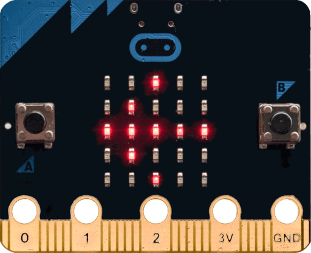
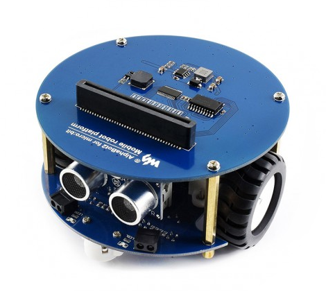
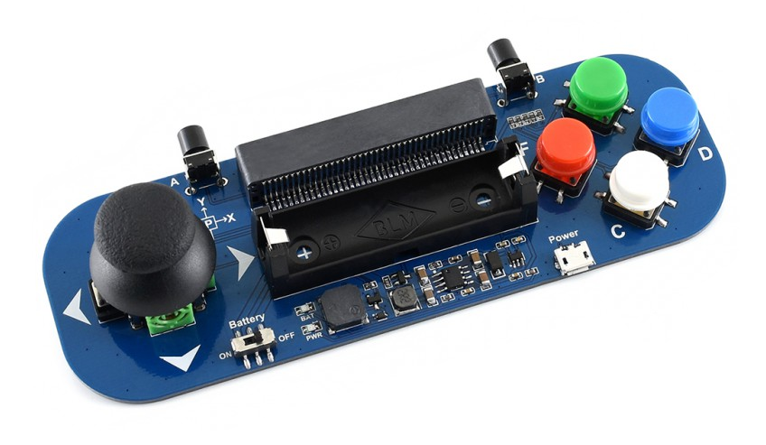

# micro:bit po polsku

----

**Nie jestem związany ani z producentem ani ze sprzedawcami micro:bit-a i peryferiów.**
Linki znajdujące się w dokumentacji prowadzą do sklepów, z których korzystałem przy zakupie
części oraz do stron, z których można ściągnąć darmowe i legalne programy oraz materiały pomocniczne.

----

# Skąd wziąć sprzęt?

Od jakiegoś czasu micro:bit jest bezpośrednio do kupienia w Polsce, za rozsądne ceny.

## Płytka bazowa `micro:bit`.

"Goła" płytka bazowa `micro:bit` kosztuje 80 do 90 zł plus przesyłka. Jest do kupienia w sklepach internetowych, jak [Nettigo](https://nettigo.pl/products/modul-edukacyjny-bbc-micro-bit), [Kamami](https://kamami.pl/microbit/564492-modul-edukacyjny-microbit-dev-14208.html) czy [Botland](https://botland.com.pl/pl/microbit-zestawy-edukacyjne/8575-microbit-bbc-podstawowy-modul-edukacyjny-cortex-m0-akcelerometr-bluetooth-led-5x5-6405227110480.html). Dalsze ceny i linki będę podawał do Botlandu.

## Zestawy

Płytkę `micro:bit` można także kupić w zestawach zawierających dodatkowe akcesoria i peryferia. **W skład poniższych zestawów wchodzi płytka `micro:bit`, więc nie trzeba kupować jej dodatkowo.**

### Micro:bit Go

Zawiera kabel USB i koszyk na baterie "paluszki. Cena [95zł](https://botland.com.pl/pl/microbit-zestawy-edukacyjne/8574-microbit-go-bbc-rozszerzony-modul-edukacyjny-cortex-m0-akcelerometr-bluetooth-led-5x5-akcesoria-640522711055.html).

**Uwaga!** Koszyk jest na baterie AA. **Nie wolno** użyć w tym miejscu akumulatorów 14500 opisanych później, mimo podobnego wyglądu. Akumulator nieodwracalnie uszkodzi `micro:bit`-a.

### SparkFun Inventor's Kit

Zawierający mnóstwo różnych peryferiów: między innymi serwomechanizm, różnokolorowe diody LED, płytkę stykową, kable, przełączniki. Cena [280 zł](https://botland.com.pl/pl/microbit-zestawy-edukacyjne/11130-sparkfun-inventor-s-kit-dla-bbc-microbit-845156008544.html).

**Uwaga!** Koszyk jest na baterie AA. **Nie wolno** użyć w tym miejscu akumulatorów 14500 opisanych później, mimo podobnego wyglądu. Akumulator nieodwracalnie uszkodzi `micro:bit`-a.

## Akcesoria i peryferia

Mając już płytkę `micro:bit`, można dokupować do niej mnóstwo dodatkowych elementów rozszerzających jej możliwości. **W skład poniższych zestawów *nie* wchodzi płytka `micro:bit`, więc trzeba ją dodatkowo dokupić.**

### [AlphaBot2](https://www.waveshare.com/alphabot2-for-micro-bit-acce-pack.htm)

Prosty, dwukołowy robot zawierający kilka czujników (ultradźwiękowy czujnik odległości, czujniki do śledzenia linii na podłożu, czujniki zbliżeniowe, programowalne diody kolorowe). Cena [230 zł](https://botland.com.pl/pl/alphabot/13305-alphabot2-acce-pack-kolowa-platforma-robota-z-czujnikami-i-napedem-dc-dla-microbit.html).

**Uwaga!** Do zasilania potrzebne są 2 akumulatory Li-Ion typu [14500](https://botland.com.pl/pl/akumulatory-li-ion/7202-ogniwo-14500-li-ion-xtar-800mah-z-zabezpieczeniami.html?search_query=14500&results=2). **Nie można** użyć w tym miejscu paluszków AA, mimo podobnego wyglądu. Nic złego się nie stanie, jednak bateria ma zbyt małe napięcie, by zasilić silniki i czujniki.

### [Gamepad/Joystick](https://www.waveshare.com/joystick-for-micro-bit.htm)
Prosty manipulator umozłiwiający sterowanie płytką `micro:bit`, zamieniając ją w (bardzo) małą konsolę gier. Cena [45 zł](https://botland.com.pl/pl/microbit-zestawy-edukacyjne/11922-gamepad-module-modul-z-joystickiem-i-przyciskami-dla-bbc-microbit.html).

**Uwaga!** Do zasilania potrzebny jest akumulator Li-Ion typu [14500](https://botland.com.pl/pl/akumulatory-li-ion/7202-ogniwo-14500-li-ion-xtar-800mah-z-zabezpieczeniami.html?search_query=14500&results=2). Kontroler potrafi też naładować taki akumulator, po podłączeniu ładowanki microUSB do gniazdka `Power` znajdującego się obok białego przycisku `C`. **Nie można** użyć w tym miejscu paluszka AA, mimo podobnego wyglądu.

# Skąd wziąć oprogramowanie?

# Trochę o sprzęcie

# Jak programować?

## Graficznie

## TypeScript

## MicroPython

## Inne

# Podstawy TypeScript
